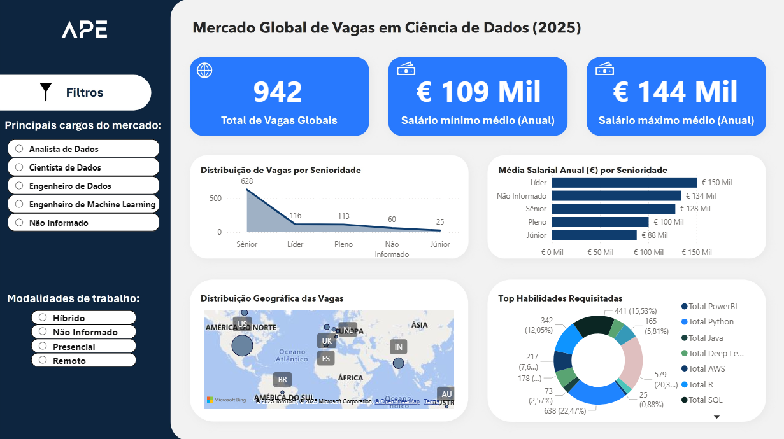
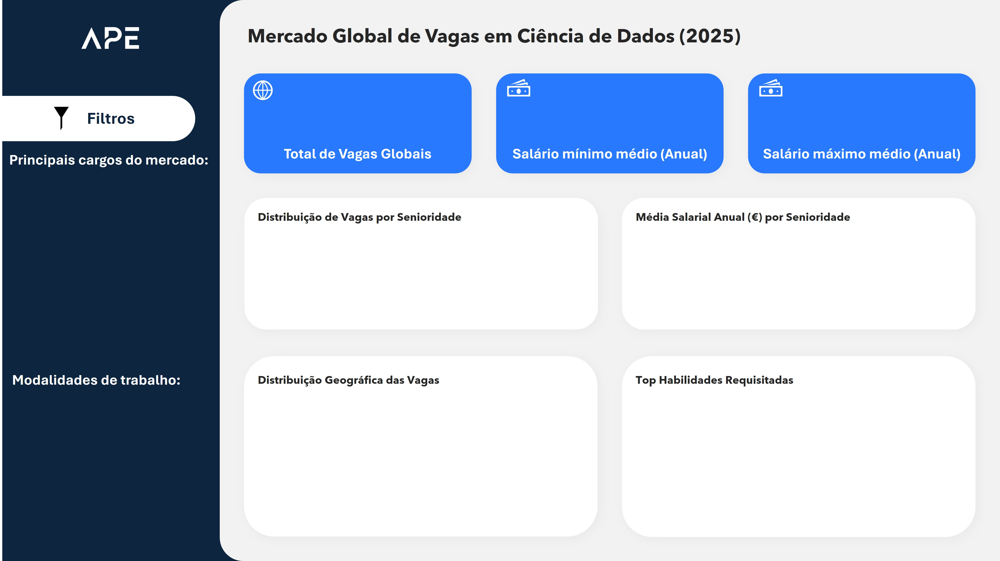

<div align="center">

# Análise de Vagas em Ciência de Dados (2025)
### Um Projeto Completo de Engenharia de Dados, Machine Learning e Business Intelligence

<p align="center">
  
  
  
  
  
  
</p>
</div>

<div align="center">
  
<p>Este README detalha o processo completo de análise de um dataset do Kaggle, desde a limpeza e engenharia de dados em SQL, passando pela criação de um modelo preditivo em Python, até a construção de um dashboard interativo no Power BI.</p>
  
</div>

## 📊 Dashboard Interativo Final

<div align="center">

<p>Abaixo, a versão final do dashboard, que consolida todos os insights gerados neste projeto.</p>



<br>

<a href="Mercado Global de Vagas em Ciência de Dados (2025).pbix" target="_blank">
  
</a>

</div>

## 📖 Visão Geral

<p>Este projeto simula um caso de uso real do dia a dia de um profissional de dados, com o objetivo de analisar o mercado global de vagas em Ciência de Dados para o ano de 2025. O processo abrange três grandes áreas:</p>
<ol>
  <li><strong>Engenharia de Dados:</strong> Tratamento, limpeza e enriquecimento dos dados brutos utilizando SQL para prepará-los para análise e modelagem.</li>
  <li><strong>Machine Learning:</strong> Desenvolvimento de um modelo de regressão para prever salários anuais com base nas características das vagas, utilizando Python e Scikit-learn.</li>
  <li><strong>Business Intelligence:</strong> Criação de um dashboard dinâmico no Power BI para visualizar os insights e permitir a exploração interativa dos dados.</li>
</ol>

## 💾 Fonte dos Dados

<p>O dataset utilizado foi o <strong>"Data Science Job Postings with Salaries (2025)"</strong>, disponível na plataforma Kaggle. Ele contém informações sobre vagas de emprego na área de dados, incluindo cargo, senioridade, localização, modalidade, e faixa salarial em euros.</p>

- **Link para o Dataset:** <a href="https://www.kaggle.com/datasets/elahehgolrokh/data-science-job-postings-with-salaries-2025" target="_blank">Data Science Job Postings with Salaries (2025) on Kaggle</a>

---

## ⚙️ Processo do Projeto

<p>O projeto foi estruturado em missões, simulando um ambiente de trabalho ágil e focado em entregas de valor em cada etapa.</p>

### 1. Engenharia de Dados com SQL

<p>A primeira fase consistiu em transformar o arquivo <code>.csv</code> bruto em uma base de dados estruturada e enriquecida. Todas as operações foram realizadas em um banco de dados <strong>SQLite</strong>.</p>

#### Missões Executadas:
- **Estruturação:** O <code>.csv</code> foi convertido para uma tabela em um banco de dados SQLite para permitir consultas complexas e performáticas.
- **Tradução e Padronização:** Colunas categóricas como <code>seniority_level</code> e <code>status</code> foram traduzidas do inglês para o português.
- **Limpeza de Dados Nulos:** Valores nulos em colunas-chave foram tratados e substituídos por "Não Informado" para garantir a consistência dos dados.
- **Engenharia de Features:** Esta foi a etapa mais crítica, onde novas colunas de alto valor foram criadas a partir de dados brutos:
    - **Salários:** A coluna <code>salary</code>, que era um texto com faixas e símbolos (<code>"€100,472 - €200,938"</code>), foi dissecada para criar três novas colunas numéricas: <code>salario_min</code>, <code>salario_max</code>, e <code>salario_avg</code>. Isso foi feito com uma query SQL complexa, utilizando funções de manipulação de texto.
      ```sql
      -- Exemplo de código para extração dos salários
      UPDATE job_postings
      SET 
          salario_min = CAST(
              CASE
                  WHEN salary LIKE '%-%' THEN 
                      TRIM(SUBSTR(REPLACE(REPLACE(salary, '€', ''), ',', ''), 1, INSTR(REPLACE(REPLACE(salary, '€', ''), ',', ''), '-') - 1))
                  ELSE 
                      TRIM(REPLACE(REPLACE(salary, '€', ''), ',', ''))
              END 
              AS REAL
          ),
          -- (lógica similar para salario_max)
      ```
    - **Localização:** As colunas <code>pais</code> e <code>estado</code> foram criadas a partir da coluna de texto <code>location</code>, permitindo análises geográficas.
    - **Habilidades (Skills):** A coluna <code>skills</code> foi decodificada para criar múltiplas colunas "flag" (ex: <code>tem_python</code>, <code>tem_sql</code>), que recebem <code>1</code> ou <code>0</code> indicando a presença de cada habilidade.

#### Tabela de Amostra (Após Limpeza em SQL)
<p>Abaixo, uma amostra das 4 primeiras linhas da tabela final, após todo o processo de tratamento e enriquecimento.</p>

| job_title | seniority_level | status | company | location | post_date | headquarter | industry | ownership | company_size | revenue | salary | skills | salario_min | salario_max | salario_avg | estado | pais | tem_python | tem_sql | tem_r | tem_machine_learning | tem_aws | tem_spark | tem_deep_learning | tem_scikit_learning | tem_tensorflow | tem_pytorch | tem_azure | tem_gcp | tem_tableau | tem_pandas | tem_git | tem_java | tem_powerbi |
| :--- | :--- | :--- | :--- | :--- | :--- | :--- | :--- | :--- | :--- | :--- | :--- | :--- | :--- | :--- | :--- | :--- | :--- | :--- | :--- | :--- | :--- | :--- | :--- | :--- | :--- | :--- | :--- | :--- | :--- | :--- | :--- | :--- | :--- | :--- |
| Cientista de Dados | Sênior | Híbrido | company_003 | Grapevine, TX . Hybrid | 17 days ago | Bentonville, AR, US | Varejo | Pública | €352.44B | Public | "€100,472 - €200,938" | "['spark', 'r', 'python', 'scala', 'machine learning', 'tensorflow']" | 100472.0 | 200938.0 | 150705.0 | TX | US | 1 | 0 | 1 | 1 | 0 | 1 | 0 | 0 | 1 | 0 | 0 | 0 | 0 | 0 | 0 | 0 | 0 |
| Cientista de Dados | Líder | Híbrido | company_005 | Fort Worth, TX . Hybrid | 15 days ago | Detroit, MI, US | Manufatura | Pública | 155,030 | €51.10B | "€118,733" | "['spark', 'r', 'python', 'sql', 'machine learning']" | 118733.0 | 118733.0 | 118733.0 | TX | US | 1 | 1 | 1 | 1 | 0 | 1 | 0 | 0 | 0 | 0 | 0 | 0 | 0 | 0 | 0 | 0 | 0 |
| Cientista de Dados | Sênior | Híbrido | company_008 | Chicago, IL . Scottsdale, AZ . Austin, TX . Hybrid | 8 days ago | San Jose, CA, US | Tecnologia | Pública | 34,690 | €81.71B | "€112,797 - €194,402" | "['sql', 'r', 'python']" | 112797.0 | 194402.0 | 153599.5 | IL | US | 1 | 1 | 1 | 0 | 0 | 0 | 0 | 0 | 0 | 0 | 0 | 0 | 0 | 0 | 0 | 0 | 0 |
| Cientista de Dados | Não Informado | Presencial | company_009 | On-site | 3 days ago | Stamford, CT, US | Finanças | Privada | 1,800 | Private | "€114,172 - €228,337" | [] | 114172.0 | 228337.0 | 171254.5 | NULL | NULL | 0 | 0 | 0 | 0 | 0 | 0 | 0 | 0 | 0 | 0 | 0 | 0 | 0 | 0 | 0 | 0 | 0 |

### 2. Modelagem Preditiva com Python

<p>Com os dados limpos, o próximo objetivo foi construir um modelo de Machine Learning capaz de prever a média salarial (<code>salario_avg</code>).</p>

#### Etapas do Processo:
1.  **Seleção:** Definição das <code>features</code> (as "pistas", como cargo, senioridade, skills) e do <code>target</code> (o alvo, <code>salario_avg</code>).
2.  **Pré-processamento:** As features categóricas (texto) foram transformadas em um formato numérico que o modelo entende, utilizando a técnica de <strong>One-Hot Encoding</strong>.
    ```python
    # Transformando colunas de texto em colunas numéricas (0s e 1s)
    X_encoded = pd.get_dummies(X, drop_first=True).astype(int)
    ```
3.  **Divisão:** Os dados foram divididos em 80% para treino e 20% para teste com <code>train_test_split</code>.
4.  **Desafio de Depuração:** Um desafio real surgiu quando o primeiro modelo (<code>LinearRegression</code>) falhou, retornando erros absurdos. A investigação revelou que o problema não era um, mas uma combinação de fatores:
    - **Outliers Extremos:** Identificação e remoção de vagas com salários anuais na casa dos milhões.
    - **Valores Nulos (NaN):** Tratamento de valores nulos que persistiram nas features e no alvo.
    - **Instabilidade do Algoritmo:** Mesmo com os dados limpos, a <code>LinearRegression</code> se mostrou instável. A decisão foi trocar de algoritmo.
5.  **Treinamento:** Um modelo mais robusto, <strong><code>RandomForestRegressor</code></strong>, foi escolhido e treinado. Este modelo, baseado em um "comitê" de árvores de decisão, é menos sensível a outliers e aprende padrões mais complexos.
6.  **Otimização:** Para extrair a melhor performance, a ferramenta <code>GridSearchCV</code> foi utilizada para testar diversas combinações de hiperparâmetros (as "configurações" do modelo) e encontrar a melhor delas.

#### Resultados do Modelo Final:
<p>Após a otimização, o modelo final foi avaliado no conjunto de teste (dados que ele nunca viu antes), alcançando os seguintes resultados:</p>

- **Erro Médio Absoluto (MAE):** **€ 28,818.08**
  - <i>Em média, as previsões do modelo erram o salário anual por aproximadamente €28.8k, um valor razoável dada a ampla variação salarial.</i>
- **Coeficiente de Determinação (R²):** **62.37%**
  - <i>O modelo consegue explicar cerca de 62% da variação nos salários com base nas características da vaga, um resultado sólido para dados do mundo real.</i>

<div align="center">
<a href="https://github.com/Guilh-Code/Analise-do-Mercado-de-Vagas-de-Ciencia-de-Dados-2025/blob/main/modelo_salario.ipynb" target="_blank">
  
</a>
</div>

### 3. Visualização de Dados com Power BI

<p>A fase final consistiu em consolidar todos os insights em um dashboard interativo. Esta foi minha primeira experiência com Power BI, focada em aprender a ferramenta do zero para criar um produto final profissional.</p>

#### Processo de Construção:
<p>O dashboard foi construído do zero, focando em clareza e interatividade.</p>

<p align="center"><i>Abaixo, uma imagem da fase inicial de planejamento e construção do layout.</i></p>
<div align="center">

</div>
<div align="center">

</div>

<p>Após a estruturação, foram aplicados design, formatação e otimização para chegar à versão final, que inclui:</p>

- **KPIs Principais:** Cartões com o total de vagas e as médias salariais.
- **Filtros Interativos:** Segmentações de dados por cargo, modalidade e indústria.
- **Análise de Senioridade:** Gráficos mostrando a distribuição de vagas e a média salarial por nível.
- **Análise Geográfica:** Um mapa interativo mostrando a concentração de vagas por país.
- **Análise de Habilidades:** Um gráfico de rosca destacando as skills mais requisitadas.

<p>O resultado é uma ferramenta que não apenas apresenta os dados, mas permite que o usuário explore e tire suas próprias conclusões, simulando um ambiente real de Business Intelligence.</p>